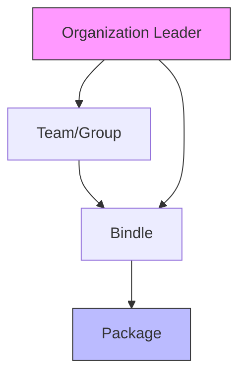
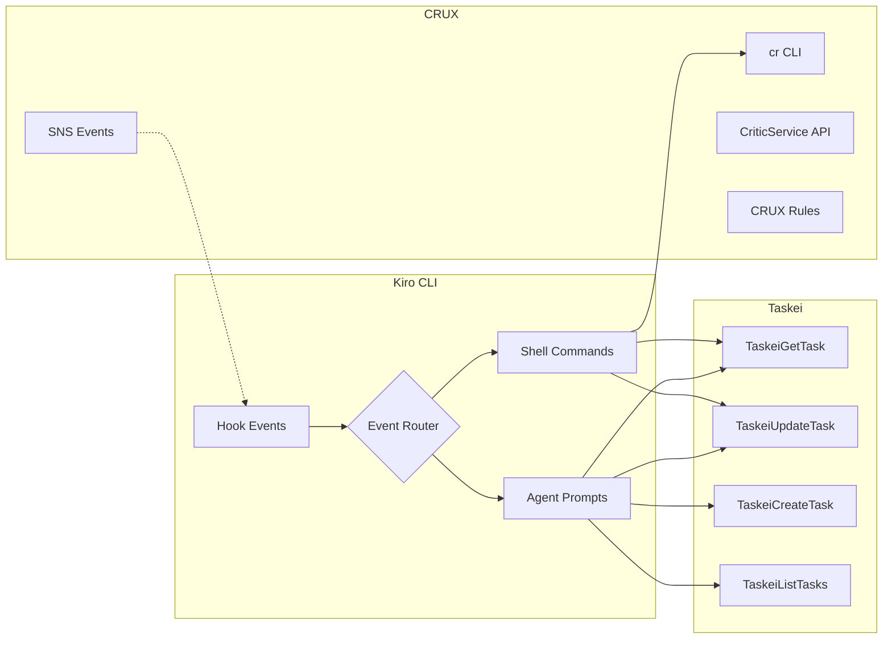
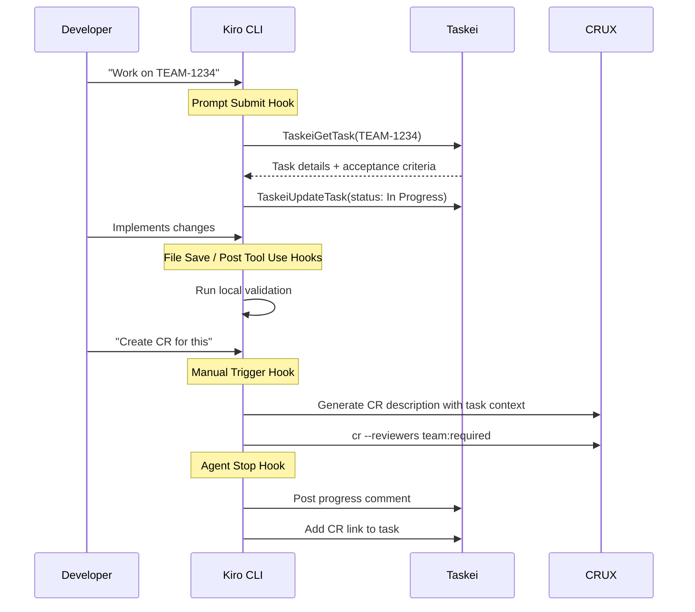

# CRUX & Taskei Integration with Kiro CLI Hooks — Research Report

## Executive Summary

This report analyzes how **CRUX** (Amazon's code review system, also known as GoodCop) and **Taskei** (Amazon's task/project management system, successor to SIM-C) can integrate with **Kiro CLI's hooks system** to create powerful developer workflow automations. Kiro hooks support event-driven triggers (Prompt Submit, Agent Stop, Pre/Post Tool Use, File events, Manual Trigger) that can execute shell commands or agent prompts — making them ideal for bridging code review and task management into the AI-assisted development loop.

---

## 1. CRUX (GoodCop) — Code Review System

### 1.1 What is CRUX?

CRUX is Amazon's code review platform integrated with Code Browser. It provides:

- **Pull-request based code reviews** for GitFarm repositories
- **CRUX Rules** — configurable policies for required reviewers, analysis tools, and preferences
- **CRUX Analyzers** — automated code analysis tools that run on every CR (e.g., Dry Run Build, InfoSecScan, Coverlay)
- **CLI tool (`cr`)** — creates and updates code reviews from the command line
- **CriticService API** — backend Coral API for programmatic CR operations

### 1.2 CRUX Rules System

Rules can be applied at multiple levels with inheritance:



**Rule types:**
- **Required Reviewers** — individuals, teams, LDAP/POSIX groups
- **Analysis Tools** — automated analyzers (required or optional)
- **Preferences** — CR behavior settings
- **SNS Watchers** — push notifications for CR events

**Rule lookup URLs:**
| Scope | URL Pattern |
|-------|-------------|
| Package | `code.amazon.com/gc/rules/for-package/PACKAGE_NAME` |
| Bindle | `code.amazon.com/gc/rules/for-bindle/BINDLE_ID` |
| Org | `code.amazon.com/gc/rules/for-org-under/LOGIN` |
| Team | `code.amazon.com/gc/rules/for-team/TEAM_ID` |
| POSIX Group | `code.amazon.com/gc/rules/for-posix-group/GROUP` |
| LDAP Group | `code.amazon.com/gc/rules/for-ldap-group/GROUP` |

### 1.3 CRUX CLI

The `cr` command creates and updates code reviews:

```bash
# Create a CR
cr

# Create with specific reviewers
cr --reviewers alias:required

# Update an existing CR
cr -r 1234567

# Include all packages
cr --all
```

**CLI Hooks:** CRUX CLI itself supports pre-CR hooks:
- `~/.config/cr/hooks/pre-cr` — global hook
- `./pre-cr` — per-directory hook
- All `cr` arguments are forwarded; non-zero exit aborts CR creation

**CR Templates:** `.crux_template.md` files in package root auto-populate CR descriptions. Supports `{{commit_message}}` macro.

### 1.4 CriticService API (Programmatic Access)

CriticService provides Coral APIs for automation:

| Use Case | API Operations |
|----------|---------------|
| Create CRs programmatically | `CreateReview`, `CreateReviewRevision`, `CloseReview` |
| Create a CRUX analyzer | `ReportStatus` API (via GoodCop Dispatch) |
| Post comments on CRs | `CreateComment`, `PublishComments` |
| Check approval status | `GetApprovalStatus` |
| Update CR info | `UpdateReviewInfo`, `AddInterest` |

**Authentication:** CloudAuth via ServiceLens. Endpoint: `critic-service-ca.corp.amazon.com`

### 1.5 SNS Event Notifications

CRUX publishes CR events to SNS topics. Filterable event types:

```json
{
  "action": [
    "publishReview",
    "closeReview",
    "approveReview",
    "overrideApprovals",
    "publishComments",
    "revokeReviewApproval"
  ]
}
```

Can also filter by `entity` (exclude AAA bots) and `pkg` (specific packages).

### 1.6 Creating CRUX Analyzers

Analyzers are event-driven services that:
1. **Receive** SNS notifications from CRUX on CR events (`CREATE_REVIEW`, `UPDATE_REVIEW`)
2. **Analyze** the code change (complete freedom in implementation)
3. **Report** status back via `ReportStatus` API (`WORKING` → `PASS`/`FAIL`/`FAULT`)

Status lifecycle: `Scheduled` → `WORKING` → `PASS`/`FAIL`/`FAULT`

```java
// Skeleton analyzer (Java + Lambda)
gcpdClient.reportStatus(new ReportStatusRequest()
    .withWorkToken(message.getWorkToken())
    .withStatus("PASS")
    .withMessage("Scanned 30 files. No issues found.")
    .withStatusDetails("### Full report\n ..."));
```

---

## 2. Taskei — Task & Project Management

### 2.1 What is Taskei?

Taskei is Amazon's modern task management platform, designed to succeed SIM-C. Key features:

- **Rooms** — team workspaces (equivalent to SIM-C top-level folders)
- **Tasks** — work items with status, assignee, priority, estimates, labels, sprints
- **Sprints** — time-boxed iterations with planning and tracking
- **Kanban Boards** — visual workflow management
- **Task Hierarchy** — Goals → Initiatives → Epics → Stories → Tasks → Subtasks

**URL:** https://taskei.amazon.dev

### 2.2 Taskei MCP Tools (Builder MCP)

Taskei is fully accessible via Builder MCP tools:

| Tool | Purpose |
|------|---------|
| `TaskeiGetRooms` | List rooms the user has access to |
| `TaskeiGetTask` | Get task details by ID (title, description, status, assignee, comments) |
| `TaskeiListTasks` | Query tasks with filters (status, assignee, sprint, priority, labels, tags) |
| `TaskeiCreateTask` | Create new tasks with full metadata |
| `TaskeiUpdateTask` | Update task attributes (status, assignee, labels, sprints, comments) |
| `TaskeiGetRoomResources` | Get room labels, sprints, kanban boards |

### 2.3 TaskeiCreateTask Schema

```json
{
  "name": "string (required)",
  "description": "string (required)",
  "roomId": "UUID (required)",
  "assignee": "string (optional, 'currentUser' or username)",
  "priority": "string",
  "type": "GOAL|INITIATIVE|EPIC|STORY|TASK|SUBTASK",
  "parentTask": "string (task ID)",
  "sprints": ["UUID"],
  "kanbanBoards": ["UUID"],
  "labels": ["UUID"],
  "tags": ["string"],
  "needByDate": "ISO datetime",
  "estimate": "number (points)"
}
```

### 2.4 TaskeiUpdateTask Schema

```json
{
  "id": "string (required)",
  "name": "string",
  "status": "string",
  "assignee": "string",
  "workflowAction": "string",
  "addLabels": ["UUID"],
  "removeLabels": ["UUID"],
  "addSprints": ["UUID"],
  "removeSprints": ["UUID"],
  "postCommentMessage": "string (markdown)",
  "transferRoom": "UUID"
}
```

### 2.5 Taskei Limitations via MCP

- **Cannot** create, update, or manage sprints (web UI only)
- **Cannot** manage room settings or policies
- **Can** filter and assign tasks to existing sprints (including "currentSprint")

---

## 3. Kiro CLI Hooks System

### 3.1 Hook Event Types

| Event | Trigger | Key Data |
|-------|---------|----------|
| **Prompt Submit** | User submits a prompt | `USER_PROMPT` env var |
| **Agent Stop** | Agent finishes responding | — |
| **Pre Tool Use** | Before tool invocation | Tool name matching |
| **Post Tool Use** | After tool invocation | Tool name matching |
| **File Create** | New file created | File pattern matching |
| **File Save** | File saved | File pattern matching |
| **File Delete** | File deleted | File pattern matching |
| **Pre Task Execution** | Before spec task starts | Task context |
| **Post Task Execution** | After spec task completes | Task context |
| **Manual Trigger** | On-demand invocation | — |

### 3.2 Hook Actions

Hooks can execute:
1. **Agent Prompts** ("Ask Kiro") — inject instructions into the agent conversation
2. **Shell Commands** ("Run Command") — execute arbitrary shell commands

### 3.3 Tool Name Matching (Pre/Post Tool Use)

- `read`, `write`, `shell`, `web`, `spec` — built-in categories
- `*` — all tools
- `@mcp` — all MCP tools
- `@powers` — all Powers tools
- `@builtin` — all built-in tools
- Regex patterns: `@mcp.*sql.*`

### 3.4 Kiro CLI Agent Configuration

Hooks can be configured in agent specs:

```json
{
  "clientConfig": {
    "kiroCli": {
      "hooks": {
        "preToolCall": ["your-hook-command"]
      }
    }
  }
}
```

### 3.5 Existing Amazon-Specific Hook Examples (from Kiro docs)

**CRUX Integration Hooks:**
- Pre-commit code review hook (manual trigger)
- CR template hook (file created)

**Brazil Package Hooks:**
- Build verification hook
- Dependency update hook

**Coding Standards Hooks:**
- License header hook
- Commit message validation hook

---

## 4. Integration Possibilities

### 4.1 Architecture Overview



### 4.2 Taskei Integration Hooks

#### 4.2.1 Auto-Link Tasks on Prompt Submit

**Event:** Prompt Submit
**Action:** Agent Prompt

```
When triggered:
1. Parse the user prompt for Taskei task IDs (e.g., TEAM-12345, Taskei-67890)
2. If task IDs found, fetch task details using TaskeiGetTask
3. Inject task context (title, description, acceptance criteria) into the conversation
4. Remind the agent to reference the task in any code changes or commit messages
```

**Value:** Automatically pulls task context into every conversation that mentions a task ID.

#### 4.2.2 Update Task Status on Agent Stop

**Event:** Agent Stop
**Action:** Agent Prompt

```
When triggered:
1. Check if the current session is associated with a Taskei task
2. Summarize what was accomplished during the agent session
3. Post a progress comment to the Taskei task using TaskeiUpdateTask
4. If implementation appears complete, suggest moving task to next workflow step
```

**Value:** Automatic progress tracking without manual updates.

#### 4.2.3 Sprint Context on Agent Spawn

**Event:** Prompt Submit (first prompt)
**Action:** Shell Command + Agent Prompt

```bash
#!/bin/bash
# Fetch current sprint tasks for context
# This could be a shell script that queries Taskei
echo "Fetching current sprint context..."
```

Combined with agent prompt:
```
When triggered:
1. Use TaskeiListTasks to fetch current sprint tasks assigned to the user
2. Provide a brief summary of in-progress and upcoming tasks
3. Suggest which task to work on based on priority and due dates
```

#### 4.2.4 Auto-Create Subtasks from Spec Tasks

**Event:** Post Task Execution (spec task completed)
**Action:** Agent Prompt

```
When triggered:
1. Review the completed spec task and its output
2. If the spec task generated implementation items, create corresponding Taskei subtasks
3. Link subtasks to the parent task
4. Add appropriate labels and sprint assignments
```

#### 4.2.5 Task-Aware File Operations

**Event:** File Create
**Action:** Agent Prompt

```
When a new source file is created:
1. Check if there's an active Taskei task in the current session
2. If so, add a comment header referencing the task ID
3. Ensure the file aligns with the task's requirements
```

### 4.3 CRUX Integration Hooks

#### 4.3.1 Pre-CR Validation Hook

**Event:** Manual Trigger
**Action:** Shell Command + Agent Prompt

```bash
#!/bin/bash
# Pre-CR validation script
set -e

# Check branch is synced
git fetch origin
LOCAL=$(git rev-parse HEAD)
REMOTE=$(git rev-parse origin/mainline)

# Run build
brazil-build release 2>&1 | tail -20

# Check for uncommitted changes
git status --porcelain
```

Combined with agent prompt:
```
When triggered:
1. Verify the local branch is synced with remote
2. Run brazil-build and analyze any failures
3. Check CRUX rules for the package: code.amazon.com/gc/rules/for-package/PACKAGE
4. Generate a CR description using the .crux_template.md format
5. Suggest the cr command with appropriate reviewers
```

#### 4.3.2 Post-Write CRUX Rule Compliance

**Event:** Post Tool Use (tool: `write`)
**Action:** Agent Prompt

```
When a file is written:
1. Check if the modified file is in a package with CRUX analyzer rules
2. Run relevant static analysis checks locally
3. Warn about potential CRUX analyzer failures before CR creation
4. Suggest fixes for common issues (coverage thresholds, security scans)
```

#### 4.3.3 CR Description Generator

**Event:** Manual Trigger
**Action:** Agent Prompt

```
When triggered:
1. Analyze git diff of uncommitted/unpushed changes
2. Check for .crux_template.md in the package root
3. If a Taskei task is associated, pull task description for context
4. Generate a comprehensive CR description including:
   - Summary of changes
   - Testing performed
   - Task/SIM references
   - Risk assessment
5. Save to clipboard or .crux_template.md
```

#### 4.3.4 CR Feedback Integration

**Event:** Prompt Submit
**Action:** Agent Prompt

```
When triggered:
1. Parse prompt for CR IDs (CR-XXXXXXX)
2. Fetch CR details and comments using ReadInternalWebsites
3. Inject CR context including:
   - Reviewer comments and requested changes
   - Analyzer results (pass/fail)
   - Approval status
4. Help address reviewer feedback in the code
```

### 4.4 Combined CRUX + Taskei Workflows

#### 4.4.1 Full Development Lifecycle Hook



#### 4.4.2 Task-to-CR Traceability Hook

**Event:** Manual Trigger
**Action:** Agent Prompt

```
When triggered:
1. Get the current Taskei task from session context
2. Analyze all code changes made during the session
3. Generate a CR description that:
   - References the Taskei task ID
   - Maps changes to task acceptance criteria
   - Includes testing evidence
4. Create the CR with task metadata in the description
5. Update the Taskei task with the CR link
```

#### 4.4.3 CR Review → Task Update Hook

**Event:** Prompt Submit
**Action:** Agent Prompt

```
When the user mentions a CR that was merged:
1. Fetch CR status from CRUX
2. If merged, find the associated Taskei task
3. Update task status to "Code Review Complete" or next workflow step
4. Post a comment with merge details
```

### 4.5 Practical Hook Configurations

#### Example: Kiro CLI Agent Spec with Hooks

```json
{
  "schemaVersion": "1",
  "name": "amazon-dev-workflow",
  "config": {
    "description": "Amazon development workflow with CRUX and Taskei integration",
    "systemPrompt": "You are a development assistant integrated with Amazon's CRUX and Taskei systems..."
  },
  "dependencies": {
    "mcpRegistry": {
      "builder-mcp": {
        "version": "latest"
      }
    }
  },
  "clientConfig": {
    "kiroCli": {
      "tools": ["@builtin", "@builder-mcp"],
      "allowedTools": [
        "fs_read",
        "@builder-mcp/TaskeiGetTask",
        "@builder-mcp/TaskeiListTasks",
        "@builder-mcp/TaskeiUpdateTask",
        "@builder-mcp/ReadInternalWebsites",
        "@builder-mcp/InternalCodeSearch"
      ],
      "hooks": {
        "preToolCall": ["echo 'Tool invocation logged'"]
      }
    }
  }
}
```

#### Example: Kiro IDE Hook — Task Context Injection

```yaml
# .kiro/hooks/taskei-context.hook
title: "Taskei Task Context"
description: "Auto-fetch Taskei task details when task IDs are mentioned"
event: prompt_submit
action: ask_kiro
instructions: |
  Check if the user's prompt contains any Taskei task IDs (patterns like
  TEAM-12345, Taskei-67890, or SIM issue IDs). If found, use TaskeiGetTask
  to fetch the task details and include the title, description, status,
  and acceptance criteria as context for your response.
```

#### Example: Kiro IDE Hook — CR Preparation

```yaml
# .kiro/hooks/cr-prep.hook
title: "CR Preparation"
description: "Prepare code review with task context and validation"
event: manual_trigger
action: ask_kiro
instructions: |
  1. Run 'git diff --stat' to see changed files
  2. Check for .crux_template.md in the package root
  3. If a Taskei task was discussed in this session, include its ID and title
  4. Generate a CR description following the template
  5. Run 'brazil-build release' to verify the build passes
  6. Suggest the cr command with appropriate options
```

---

## 5. Key References

| Resource | URL |
|----------|-----|
| CRUX User Guide | https://docs.hub.amazon.dev/docs/crux/user-guide/ |
| CRUX Rules | https://docs.hub.amazon.dev/docs/crux/user-guide/crux-rules/ |
| CRUX API Guide | https://docs.hub.amazon.dev/docs/crux/api-guide/howto/ |
| CRUX CLI Guide | https://docs.hub.amazon.dev/docs/crux/cli-guide/howto/ |
| Creating CRUX Analyzers | https://docs.hub.amazon.dev/docs/crux/user-guide/create-analyzer/ |
| CRUX Rules Lookup (llms.txt) | https://code.amazon.com/gc/rules/llms.txt |
| CRUX Analyzer Registry | https://code.amazon.com/gc/partners |
| Taskei | https://taskei.amazon.dev |
| Taskei Wiki | https://w.amazon.com/bin/view/Taskei |
| Taskei User Guide | https://w.amazon.com/bin/view/Taskei/User-Guide |
| Builder MCP Task Management | https://docs.hub.amazon.dev/docs/builder-mcp/user-guide/use-cases-task-management/ |
| Kiro Hooks (Public) | https://kiro.dev/docs/hooks/ |
| Kiro Hook Types | https://kiro.dev/docs/hooks/types |
| Kiro Internal Hooks Guide | https://docs.hub.amazon.dev/docs/kiro/user-guide/howto-hooks/ |
| Kiro Internal User Guide | https://docs.hub.amazon.dev/docs/kiro/user-guide/ |
| AIM Agent Spec Reference | https://docs.hub.amazon.dev/docs/aim/user-guide/concepts/agent-spec/ |
| Slack: #crux-analyzer-interest | https://amazon.enterprise.slack.com/archives/C0329ALNGQ5 |
| Slack: #taskei-interest | https://amazon.enterprise.slack.com/archives/C03RYGYPZFE |

---

## 6. Recommendations

### Quick Wins (Low effort, high value)
1. **Task context injection hook** (Prompt Submit) — Parse task IDs from prompts and auto-fetch context
2. **CR description generator** (Manual Trigger) — Generate CR descriptions with task references
3. **Commit message validation** (Manual Trigger) — Ensure task IDs are in commit messages

### Medium-Term Integrations
4. **Progress tracking** (Agent Stop) — Auto-post session summaries to Taskei tasks
5. **CRUX rule awareness** (Post Tool Use on `write`) — Warn about analyzer compliance
6. **Sprint dashboard** (Manual Trigger) — Show current sprint status at session start

### Advanced Integrations
7. **Custom CRUX analyzer** — Build an analyzer that validates task references in CRs
8. **SNS-driven automation** — React to CRUX events to update Taskei task status
9. **Full lifecycle tracking** — End-to-end task → code → CR → merge → task-complete automation
